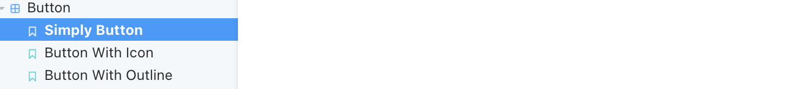
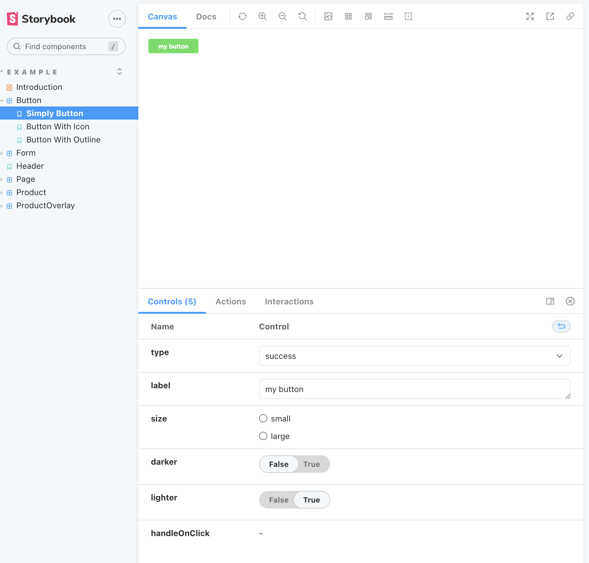
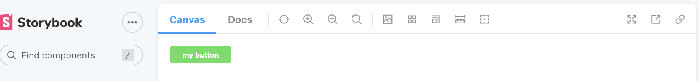
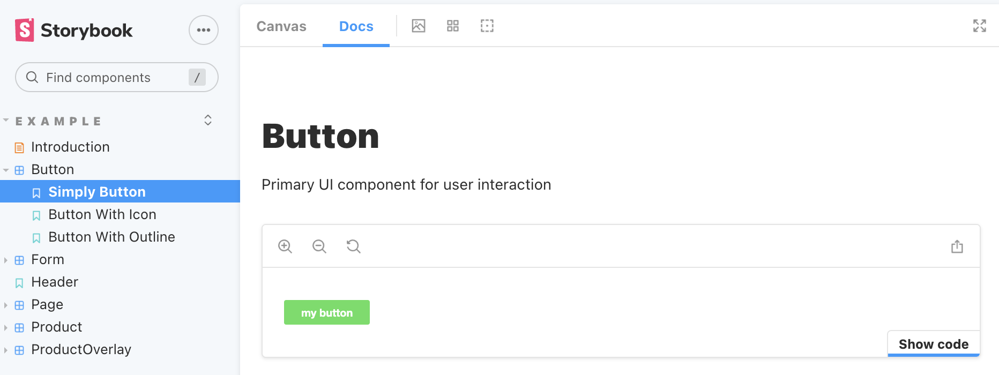
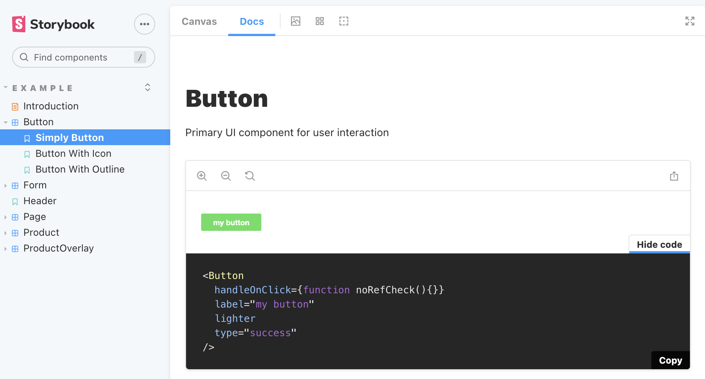

## About

This is a component library build with [Storybook](https://storybook.js.org/).

## Install

- To use this package, you fisrt need to have React app installed.
- [Link](https://reactjs.org/docs/getting-started.html) This is the docs about how to install React app.
- In your React app `run`

```js
npm i component-library-hemin
```

## How to use

- [Link](https://mmbliv.github.io/component-library/?path=/story/example-introduction--page) This is the user interface for this commponent library.
- Each component has serveral different stories. For example, the Button component has three stories.
  
- When you click each story you have access to control specific parts of the story.
  
- At the top of the interface, there is a Docs option, and this is the place where you can get the exported code.
  
- In the Docs page, when you click `Show code` you can have the code you need to use the component.
  
  
- In your React app you can use this Button component
  ```js
  import { Button } from "component-library-hm";
  function App() {
    return (
      <div className="App">
        <Button
          handleOnClick={function noRefCheck() {}}
          label="my button"
          lighter
          type="success"
        />
      </div>
    );
  }
  export default App;
  ```
