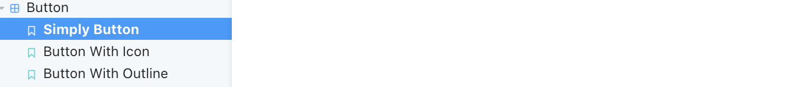
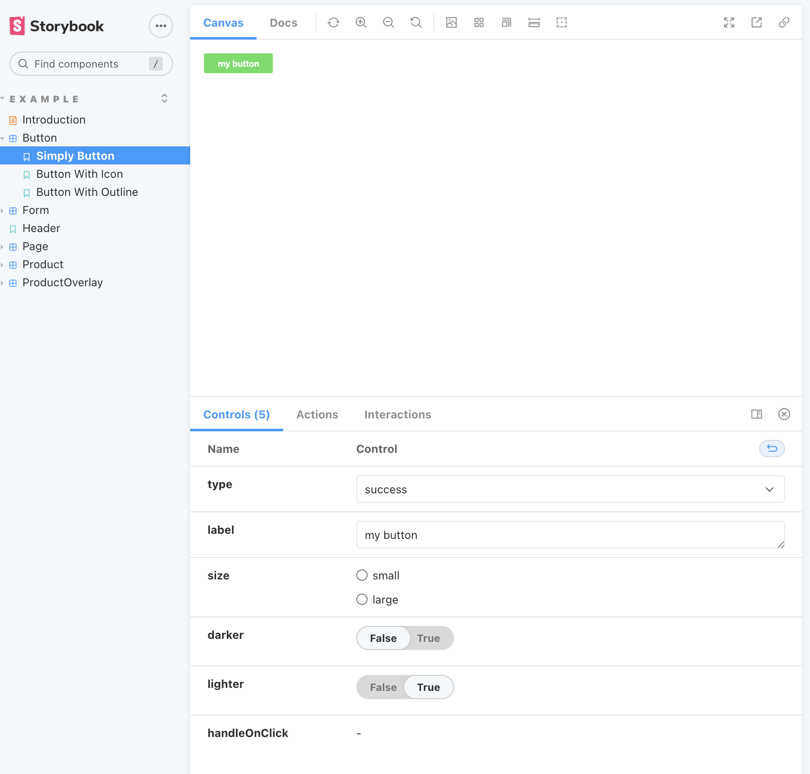
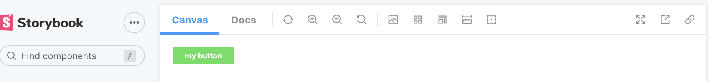
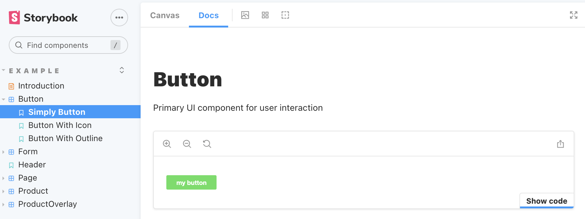
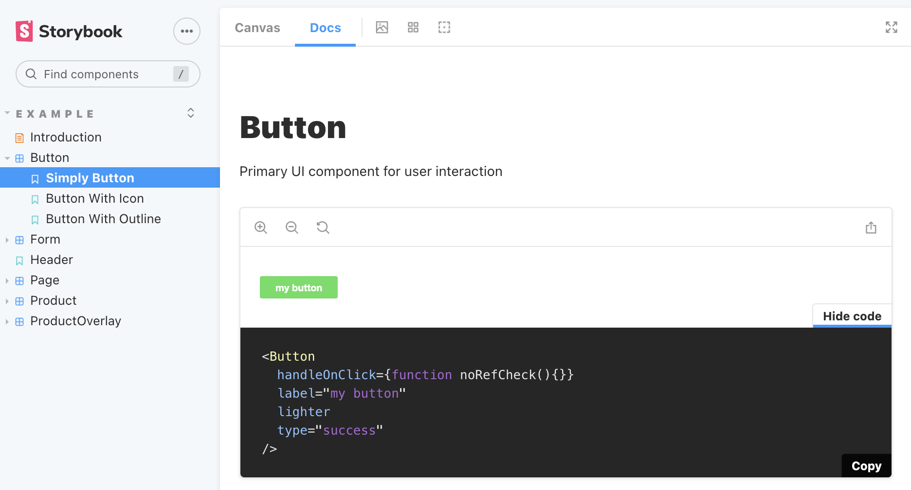

## About

This is a component library built with [Storybook](https://storybook.js.org/).

## Installation

- To use this package, you first need to have a React application installed. Refer to this [link](https://reactjs.org/docs/getting-started.html) for instructions on how to install a React application.
- In your React application, run the following command:

  ```js
  npm i component-library-hm
  ```

## Usage

- Refer to this [link](https://mmbliv.github.io/component-library/?path=/story/example-introduction--page) for the user interface of this component library
- Each component has several different stories, for example, the Button component has three stories, which are 'Simply Button', 'Button With Icon' and 'Button With Outline'.
  
- When you click on each story, you have access to control specific parts of the story.
  
- At the top of the interface, there is a "Docs" option, which is where you can access the exported code.
  
- In the Docs page, when you click "Show code," you can access the code needed to use the component.
  
  
- In your React application, you can use the Button component by importing it and including it in your JSX:
  ```js
  import { Button } from "component-library-hm";
  function App() {
    return (
      <div className="App">
        <Button
          handleOnClick={function noRefCheck() {}}
          label="my button"
          lighter
          type="success"
        />
      </div>
    );
  }
  export default App;
  ```
